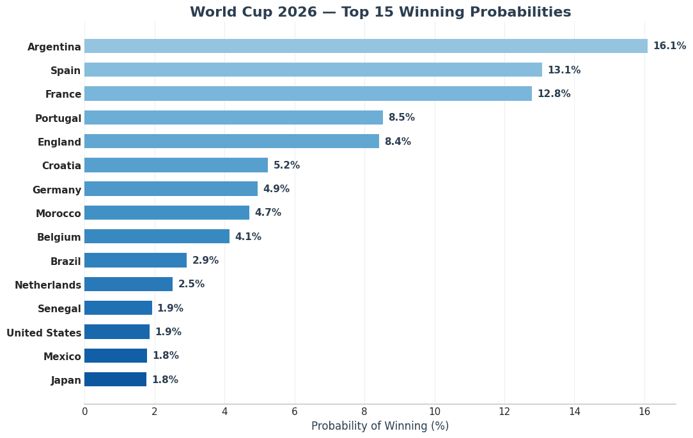
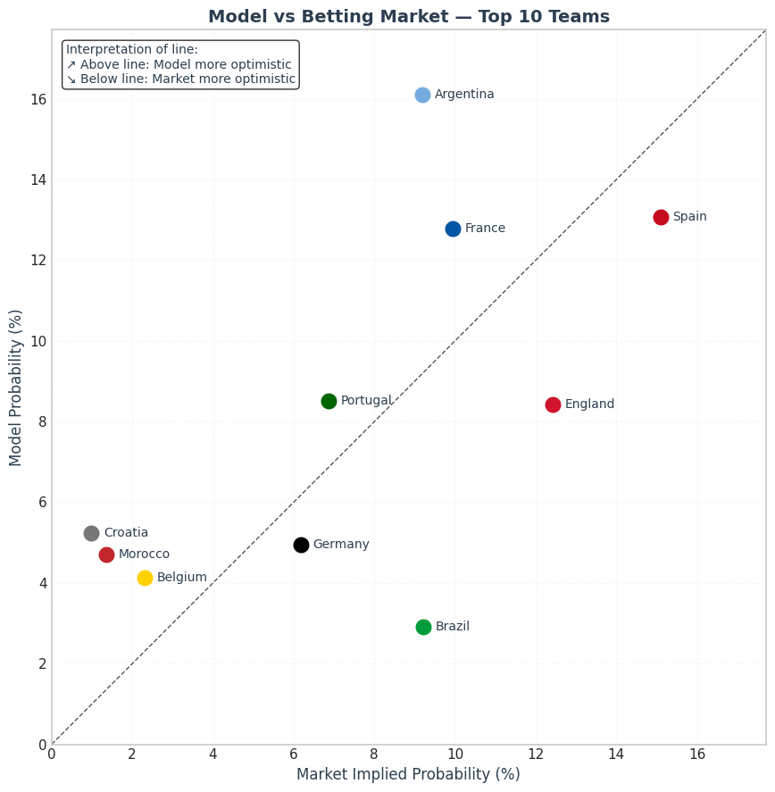

# ⚽ World Cup 2026 Prediction — Monte Carlo meets modern football

> *Can we predict the World Cup?*
> No.

> *Can we build a model that understands modern football, momentum and tournament chaos better than pure odds?*
> That’s what this project tries to do.

---

## 🌍 Project overview

This repository contains a **Monte Carlo simulation of the FIFA World Cup 2026**, combining:

* A **machine learning match model** (Gradient Boosting)
* **FIFA ranking & points**
* **Recent form** (smoothed last-5 matches)
* **Head-to-head history**
* **Penalty shootout performance**
* **Tournament variance**
* **Historical achievements with strong recency decay**
* **Modern football strength** (tactical + structural)

The goal is **not** to predict exact results,
but to **estimate realistic championship probabilities** under a **new World Cup format**.

---

## 🏆 Why World Cup 2026 is different

World Cup 2026 is *not* like previous tournaments:

* 🇺🇸🇨🇦🇲🇽 **3 host countries**
* 🏟️ Long travel distances
* 🧠 Greater importance of squad depth & rotation
* 🆕 **New format**:

  * 12 groups of 4 teams
  * 12 group winners qualify directly
  * Best 8 runners-up advance
  * Remaining runners-up play a **play-in round**
  * Then classic knockouts (Round of 16 → Final)

This format introduces **more randomness**, especially for:

* Traditional powers with slow starts
* Teams relying on “one perfect match”
* Physically fragile squads

---

## 📊 High-level pipeline

```text
Raw match data (2000 → present)
        ↓
Feature engineering
        ↓
Gradient Boosting match model
        ↓
Tournament simulation (5,000+ runs)
        ↓
Champion probability distribution
```

Each simulation represents **one possible World Cup universe**.

---

## 🛠️ Installation & Use

This project is designed to be **fully reproducible** and easy to explore locally.

### 🔧 Requirements

* Python **3.10**
* `pip`
* Virtual environment support (`venv`)

---

### 📦 Installation

Clone the repository:

```bash
git clone https://github.com/YOUR_USERNAME/world-cup-2026-simulation.git
cd world-cup-2026-simulation
```

Create and activate a virtual environment:

```bash
python -m venv venv
source venv/bin/activate   # macOS / Linux
venv\Scripts\activate      # Windows
```

Install dependencies:

```bash
pip install -r requirements.txt
```

---

### ▶️ How to use the project

The project is organized as a **notebook-based pipeline**, where each notebook builds on the previous one:

```text
notebooks/
├── 01_raw_data_inspection.ipynb
├── 02_feature_engineering.ipynb
├── 03_modeling.ipynb
├── 04_world_cup_2026_simulation.ipynb
└── 05_results_and_insights.ipynb
```

Run the notebooks **in order** to reproduce the full analysis:

1. **Data preparation**
   Cleans and aligns historical match data and rankings.

2. **Feature engineering**
   Builds team-level and match-level features.

3. **Match model training**
   Trains the Gradient Boosting match outcome model.

4. **Tournament simulation**
   Runs thousands of World Cup simulations under the 2026 format.

5. **Results & insights**
   Generates visualizations, comparisons with betting markets, and conclusions.

---

### 🧪 Reproducibility notes

* All library versions are **explicitly pinned**
* Random seeds are fixed where applicable
* Results may still vary slightly due to:

  * Monte Carlo randomness
  * Floating-point behavior across systems

This is intentional: **variance is part of the model philosophy**.

---
## 📚 Data sources

This project relies on multiple data sources:

* **Historical international match results**  
  Obtained from Kaggle  
  *[International Football Results from 1872 to 2026](https://www.kaggle.com/datasets/martj42/international-football-results-from-1872-to-2017)*

* **FIFA rankings and points over time**  
  Collected from publicly available *[FIFA ranking](https://inside.fifa.com/es/fifa-world-ranking/men)* data, aggregated historically to approximate team strength evolution across tournaments. 

* **Tournament performance & achievements**
  Used to reduce historical bias in favor of modern performance.

All datasets were processed and aligned to focus on **modern international football (2000 → present)**, with strong emphasis on **recency and tournament relevance**.

---

## 🧠 Match model philosophy

A match is decided by:

* **Baseline strength** (FIFA points)
* **Recent momentum** (smoothed form)
* **Tactical maturity** (modern football bonus)
* **Psychology & experience** (recent achievements)
* **Randomness** (increasing with tournament round)

Later rounds are **less predictable** by design.

```python
ROUND_VARIANCE = {
    "group": 18,
    "play-in": 30,
    "round_of_16": 45,
    "quarterfinal": 55,
    "semifinal": 70,
    "final": 85
}
```

The World Cup final is chaos.
The model embraces that.

---

## 🆕 Modern football matters

One key design choice:
**historical success alone is not enough**.

Winning a World Cup in 2002 should not outweigh:

* Tactical structure
* Pressing systems
* Squad automation
* Tournament adaptability

We introduce a **Modern Football Strength** bonus:

```python
MODERN_TEAMS = {
    "Argentina": 6,
    "Spain": 6,
    "France": 6,
    "England": 5,
    "Morocco": 5,
    "Portugal": 5,
    "Germany": 4,
    "Brazil": 4,
    "Belgium": 4,
    "Netherlands": 4,
    "Croatia": 4,
    "Japan": 3,
    "Senegal": 3,
    "Uruguay": 3
}
```

This is **not arbitrary**:

* Rewards tactical continuity
* Penalizes talent-without-system
* Reflects post-2018 international football reality

---

## 📈 Champion probabilities

After 5,000 simulations:



### 🧐 But betting houses say Spain is favourite…



Yes — and that’s **exactly the point**.

Bookmakers price:

* Market sentiment
* Volume
* Risk balancing

This model asks a different question:

> *Which teams are best adapted to modern tournament football under extreme variance?*

Across thousands of simulated World Cups, the answer consistently leans towards:

* **Argentina** — tournament maturity, adaptability, and resilience  
* **Spain** — structural continuity and tactical control  
* **France** — depth, athleticism, and knockout efficiency
* **Portugal** — elite talent with growing tactical balance
* **England** — modern systems finally matching elite talent  

---

## 🔍 A revealing real-world test: the Finalissima

An upcoming **Finalissima between Spain and Argentina** will be particularly revealing.

It brings together the **two most consistently favored teams in the simulation**.

While a single match proves nothing, this clash reflects exactly what the model highlights:
**modern football is no longer about raw talent alone, but about systems, adaptability, and execution under pressure.**

---

## 🏔️ A mental picture

Imagine the World Cup as a mountain.

* Some teams climb fast but fall early
* Some climb slowly but never stop
* Some reach the summit often, but not always first

Argentina doesn’t always win.
But **they reach the final stages in most simulated universes**.

That’s what matters.

---

## 🇺🇸🇨🇦🇲🇽 Hosts & regional context

Host teams are treated carefully:

* **United States**

  * Athletic, improving, home support
  * Still tactically inconsistent

* **Mexico**

  * Experience & crowd advantage
  * Declining generation → penalized

* **Canada**

  * Intensity & speed
  * Limited tournament experience

None receive artificial “host boosts”, only **structural advantages** reflected in data.

---

## ⚠️ Limitations (important)

This project is **not omniscient**.

### Known limitations:

* No explicit player-level injuries
* No real-time squad selection
* Coaching changes not dynamically modeled
* Chemistry is inferred, not measured
* FIFA rankings are imperfect proxies
* Some national teams evolve rapidly (Japan, Morocco)

And most importantly:

> **Football is not deterministic.**

If it were, Greece 2004 would not exist.

---

## 🔮 Future improvements

Planned or possible extensions:

* 🧍 Player-level embeddings (club form → national team)
* 🧠 Coaching style vectors
* 🗺️ Travel & climate fatigue modeling
* 🟥 Discipline risk (cards & suspensions)
* 📊 Dynamic odds comparison vs bookmakers
* 🏟️ Stadium-specific performance effects

---

## ❤️ Final thought

This project is not about being *right*.

It’s about:

* Thinking clearly
* Respecting uncertainty
* Modeling football as the chaotic, beautiful game it is

If your favorite team wins in the simulation — great.
If it doesn’t — that’s football.

---

## ⚽ Because in the end…

> *The ball is round, the match lasts 90 minutes, and anything can happen.*

Models can guide us.  
History can inform us.  
But once the initial whistle blows, football belongs to chaos.
